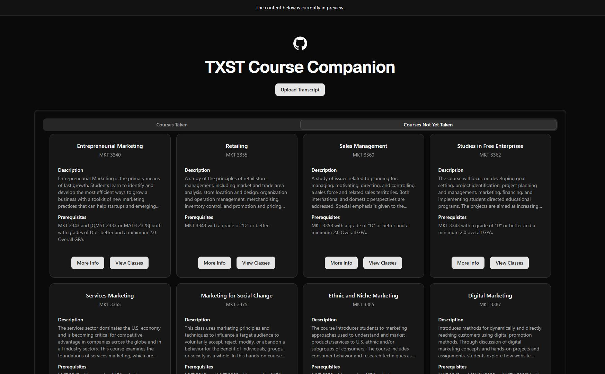

# TXST Course Companion – Group 21

A web application that helps Texas State students explore courses based on their unofficial transcript.



## 👥 Team Members
- Noah Sadeghi
- Everett Holmes
- Steven Conde

---

## 📦 Prerequisites

Make sure you have the following installed:

- [Node.js](https://nodejs.org/) (v18+ recommended)
- [Python](https://www.python.org/) (v3.10+)
- Git
- Microsoft Visual C++ 14.0 or greater is required (if on Windows)

---

## 🛠️ Setup Instructions

### 1. Clone the Repository

```bash
git clone https://git.txstate.edu/wuq10/txst-cc.git
cd txst-cc
```

---

### 2. Client Setup (React + Vite)

```bash
cd client
npm install
```

---

### 3. Server Setup (Flask + Playwright)
*Server-side testing was mainly tested on Windows*
```bash
cd ../server
python -m venv venv
# On Windows:
venv\Scripts\activate
# On macOS/Linux:
source venv/bin/activate

pip install -r requirements.txt
```

---

## 🚀 Running the App

### Start the Client

```bash
cd client
npm run dev
```

### Start the Server

```bash
cd server
venv\Scripts\activate
py app.py
```

---

## 📁 Project Structure

```bash
txst-cc/
│
├── client/             # React frontend using Vite and ShadCN
├── server/             # Flask backend server
├── uploads/            # Temporary uploaded transcripts (PDFs)
├── data/               # Course JSON files by major
└── requirements.txt    # Python backend dependencies
```

---

## 📄 Features

- Upload an unofficial transcript PDF
- Parse taken courses + major automatically
- View available courses based on major
- View professor & syllabus data via HB2504
- RateMyProfessor integration for instructors

---

## 💡 Notes

- `server/app.py` uses Playwright for scraping. Make sure Chromium is installed via:

```bash
playwright install
```

- If you're testing with `curl`, use:

```bash
curl -X POST http://localhost:5000/upload -F "file=@./uploads/transcript1.pdf"
```

---

## 🧪 Development Tips

- Restart the Flask server if changes are made to `app.py`
- Make sure `venv` is activated when working in the server folder

---

## ✅ What else could we do?

- ~~Add a schedule builder~~
- Improve user interface

## To-do

-Fix macOS problem
